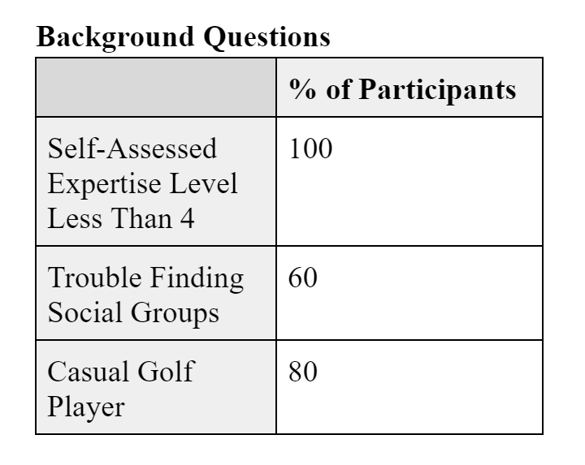
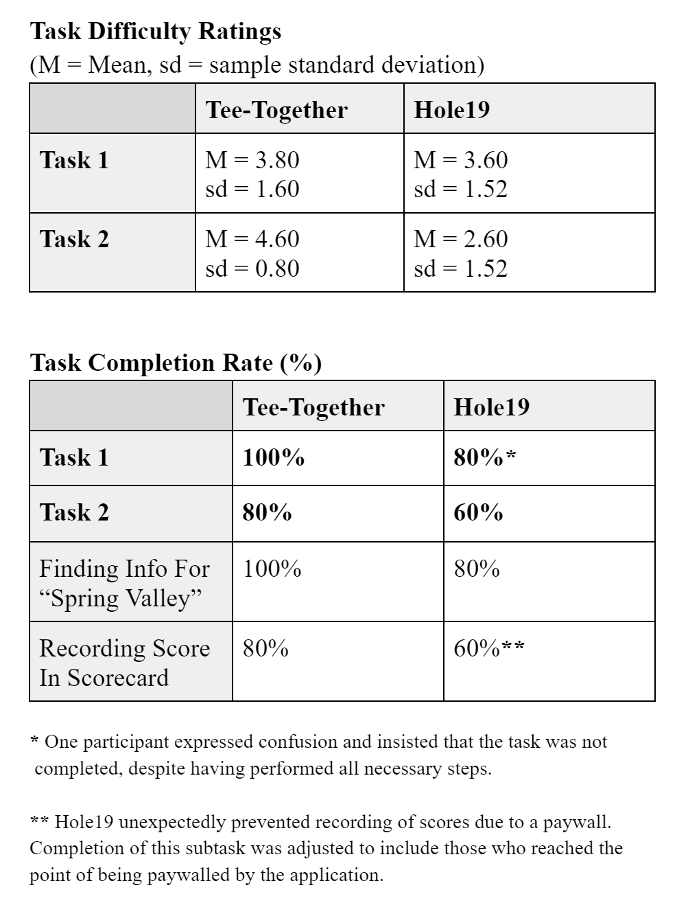
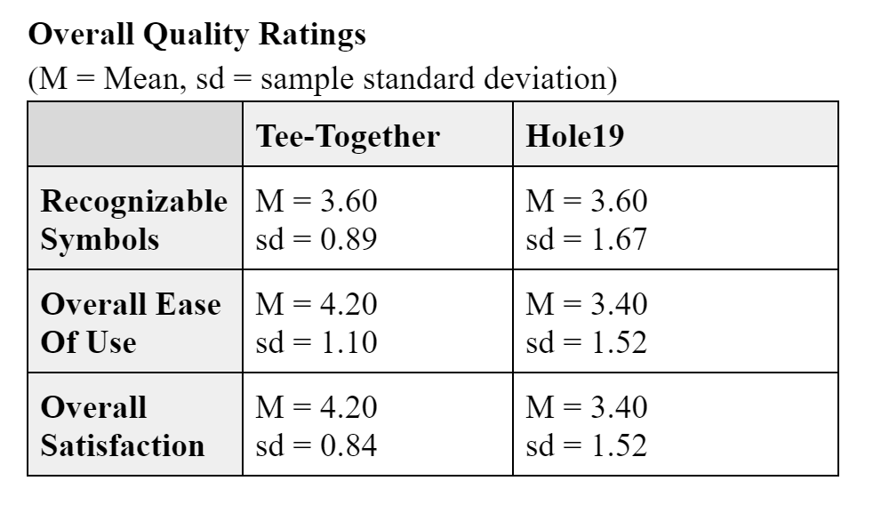

# Phase III: Prototypes and User Testing

## Relevant Links

- [Usability Test Protocol](./Tee-Together_Protocol.pdf)
- [Usability Test Data Spreadsheet](./Tee-Together_Protocol.xlsx)
- [Usability Test Prototype](https://xd.adobe.com/view/62b36a4e-d502-40a3-a217-805356606897-37e0/?fullscreen&hints=off)

## Introduction

As we continue to innovate and develop Tee-Together, we gain meaningful feedback as we move closer to our final product. For the project's third phase, we developed a prototype and conducted user tests in cooperation with the IRB. We developed protocols and created informed consent forms that met the standards required to perform these tests. Through these tests, we gained critical feedback on our prototype and reassurance that the direction we are taking Tee-Together is correct. The feedback we received has given us a better understanding of user goals and user thought processes when utilizing our application. These tests also revealed how we performed to meet user needs compared to our competitors. The following report will highlight our methods, findings, and conclusions of this innovative process. 

## Methods

Shortly after the conclusion of Phase II, informal feedback was once again drawn from Software Engineering students during a presentation by our software engineers. The participants were asked two questions:
- For those familiar with golf, which scoring system would you rather see in our app - total strokes or strokes from par?
- Would you consider collaborative scorecards (i.e. multiple players filling out the same scorecard simultaneously) to be a feature worth pursuing?

Once a working prototype was produced, we performed a usability test (n=5) with fellow Usability Engineering students acting as participants. To ensure the participants could be considered genuine users of the app, the participants were informally screened in advance of the study, with some golf knowledge and/or experience being required to participate.

Before each usability test began, the moderator read the test's Informed Consent form out loud to the participant, detailing the minimized risks associated with the study. All 5 participants read and signed the form, approving each test to go forward.

The first component of the test involved gaining non-identifying information from participants. This was done in the form of five questions:
1. On a scale of 1-5 (1 being novice, 5 being professional) how would you rate your level of expertise with the game of golf?
2. Do you have trouble meeting new people and/or finding people with the same interests as you?
3. Do you prefer to play golf casually or competitively?
4. Think back to other social media applications you have used in the past. What features do you enjoy most from these applications?
5. Lastly, when considering these social media applications, do you have any gripes or concerns with them?

Although initial screening was performed to ensure no participants were a complete mismatch for the app, questions 1 and 3 were asked to gauge whether the participant aligns with our expected audience of non-professional casual golf players, and question 2 was asked to judge whether the participant might engage with the social aspects of our app. Questions 4 and 5 were asked in the hopes of discovering any broad desires in social media our app could aspire to fulfill, or pitfalls to be avoided.

After these questions, participants were then asked to complete two tasks on both Hole19 and Tee-Together, with the order of the apps being randomized between participants.

Task 1 for each app involved signing on to a premade account and viewing the profile information. This task was set up for comparing the relative ease of creating/signing into an account on each app. Task 2 for each app involved finding information on a course named "Spring Valley", creating a scorecard for that course, and recording a score for the course's first hole. This task was set up to compare the clarity of each app's Courses page and scorecard creation process.

In order to gain quantifiable data on the ease of using each app, participants were asked to rate the ease of a task on a scale from 1-5 (1 being very difficult, 5 being very easy) immediately after completing it.

After completing the tasks, we asked for several more quantitative ratings of the two apps to create broader comparisons between the two apps' user experiences:
- On a scale from 1-5 (1 being confusing, 5 being clear) how easily were you able to understand and recognize the symbols used by each app (for example, the icons at the bottom of the app)?
- On a scale from 1-5 (1 being tedious, 5 being enjoyable), how satisfying was it to complete the tasks for each app?
- On a scale from 1-5 (1 being dissatisfied, 5 being satisfied) how would you rate the ease of using each app?

Participations were also asked about any potential features they would like to see added to Tee-Together, and given time to provide any additional feedback on either app.

## Findings
#### Informal Feedback
The informal feedback responses, directly as transcribed by the Tee-Together software engineers, are as follows:

> For those familiar with golf, which scoring system would you rather see in our app - total strokes or strokes from par?
- _Subjective, some prefer total strokes some prefer par. Maybe have both as options to our app?_

> Would you consider collaborative scorecards (i.e. multiple players filling out the same scorecard simultaneously) to be a feature worth pursuing?
- _Yes, it would make it easier to see fellow players scores. Many play per cart, so 1 scorecard kept. Additional functionality for both options, sync phones together._

In summary, the Software Engineering students had no clear preference for golf scoring systems, and suggested a system which integrates both our propositions. They also approved of our collaborative scorecard idea. 

#### Usability Test

The responses to the initial background information questions are summarized in the table below. Note that the one partipicant who didn't identify as a casual golf player explained that they have not played golf at all; no participants reported playing golf competitively. 

In response to the questions regarding social media likes and dislikes, participants mentioned that they like when social media apps offer stories like Snapchat and ranking systems. On the other hand, participants disliked social applications that mismanaged users' personal information, or provided recommendation algorithms which pigeonhole content. Sharing of location data came up both as a like and dislike between two separate participants.

The difficulty rating and completion rates of tasks within each app are shown below. Note that some ratings have caveats associated with them, denoted by asterisks (*).

## Conclusions

!!! Discoveries derived from the methods and their findings. Interpret how the findings translate into new insights into UX design recommendations. Describe those recommendations and how they should shape future work. In this section, include the new design recommendations based on the latest user insights. !!!

## Caveats

The first major caveat was that we had the absolute minimum acceptable sample size (n = 5). This may mean lead to skewed results because the small limited pool of participants can be greatly affected by biases. While our team was running our study we unfortunately had a participant not arrive so we were left with only five responses instead of six. Also, Task 1 originally included adding a profile picture however we had to remove that part of task one. The act of adding a profile picture could not be included in Hole19 due to potential privacy concerns. However, the participants who did attempt to add the profile picture were not able to accomplish the task anyway. The removal of this part of Task 1 was disclosed to some, but not all, participants, which may have affected their difficulty rating for Task 1. Another caveat is the fact that we had a limited pool of participants. All the participants came from the Usability engineering class which led to biases in our results. Because this was a class we could not effectively screen our participants as much as we would have liked. Finally, Hole19 was paywalled so some of the features that could have made accomplishing tasks easier were not accessible to the users while they were participating in the study.
