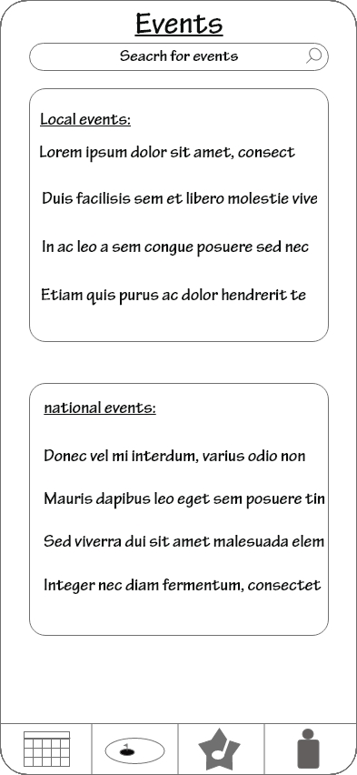

# Wireframes
This is the first screen a new user will see.

When creating an account, the user is taken to this page.

After account creation or login, the user will see the events page.

Tapping an event brings up the details page.

The next icon on the bottom bar takes the user to the course page.

Tapping on the course takes the user to the course details page.

The 2nd from the left icon on the bottom bar takes the user to scorecard creation.

The leftmost icon takes the user to the user profile page.

Tapping the view stats link takes the user to the stats page.

